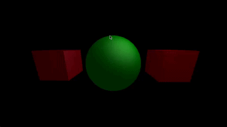

'ant' should be sufficient to build and run the program, provided you have
ant installed. Tested on OS X.

See Controls.txt for precise instructions on how to manipulate the models.

This project features three different lighting models:
- Lambertian Diffuse
- Phong Specular
- Blinn Specular

It also includes an extra wireframe shader that reveals the underlying
mesh of an object. The sphere and cube models were generated in Blender; they
are imported via a custom .obj file parser.

The camera and point light are positioned using spherical coordinates and
a target position.
